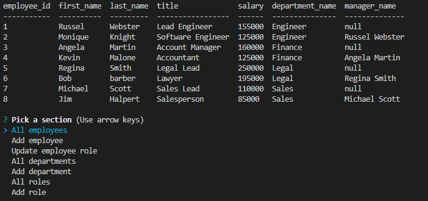

# sql-employee-tracker
 
## Description
This project helps the user keep track of new and existing employees.
 
## Usage
To use this project, the user must first open the terminal and make sure the sql.files are properly implemented.
The user must then type "node server.js" in the terminal.
A prompt will then appear, which require the user to answer questions if need.
If all steps are done correctly, the terminal should display a filled table, with the changes the user may or may not have made.
 
## Video Walkthrough

 
Link to video: https://drive.google.com/file/d/1CmWuhbnONluIuru8lv8MbPcDtyVQ615Y/view
 

